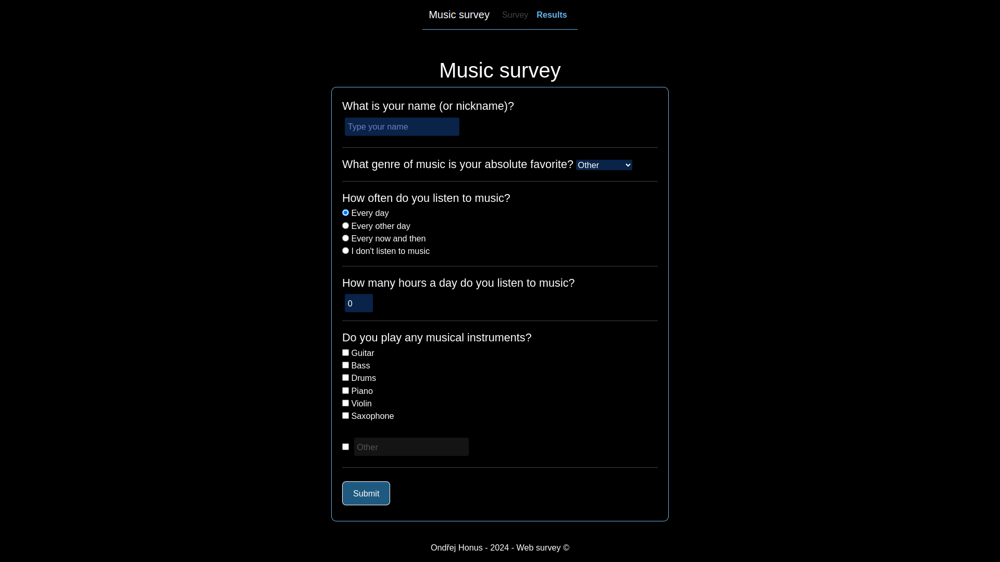

#  Web Survey
A web application made in node.js that takes results from a survey 
and displays it. 

# Table of contents  
1. [Introduction](#web-survey)  
2. [Run Locally](#run-locally)  
    1. [Clone](#clone-the-project)  
    1. [Install](#install-dependencies)  
3. [Tools](#tools)  

## Screenshots  

## Run Locally  

### Clone the project  

~~~bash  
git clone https://github.com/ondrejhonus/web_survey.git
~~~

### Go to the project directory  

~~~bash  
cd web_survey
~~~

### Install dependencies  

~~~bash  
npm install
~~~

Start the server  

~~~bash  
node .
~~~

## Tools

**Graphs made with [Chart.js](https://www.chartjs.org/)**

**Navbar made with [Bootstrap5](https://getbootstrap.com/)**